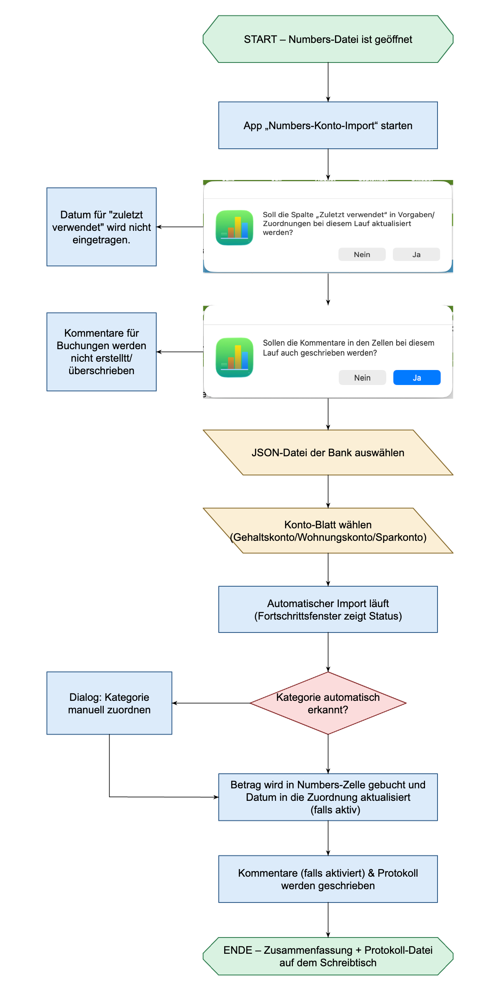

# README: AppleScript Numbers-Konto-Import

Dieses AppleScript liest Konto-Transaktionen aus einer JSON-Exportdatei ein und verbucht die Beträge automatisch oder interaktiv in deinem **Apple Numbers**-Finanzdokument.

---

## ⚙️ Voraussetzungen

1. **Betriebssystem:** macOS (Ausführung über *Skripteditor*, *Skript-Menü* oder als installierte App).
2. **Apple Numbers:** Das Finanz-Dokument muss vor dem Start geöffnet sein.
3. **Bedienungshilfen / System Events:** Dem ausführenden Programm muss unter *Systemeinstellungen > Datenschutz & Sicherheit > Bedienungshilfen* der Zugriff gewährt werden (erforderlich für das Schreiben von Zell-Kommentaren per GUI-Automation).

---

## 📋 Erforderliche Tabellenstruktur in Numbers

Dein Numbers-Dokument muss aus folgenden Blättern und Tabellen aufgebaut sein:

### 1. Blatt `Vorgaben` (Pflicht)
Enthält die Steuer- und Zuordnungstabellen:
* **Tabelle `Zuordnungen`:**
  * **Spalte 1:** Partner-Muster / Suchbegriff
  * **Spalte 2:** Ziel-Kategorie im Format `Oberkategorie / Unterkategorie`
  * **Spalte 3:** *Richtung* (`Gutschrift`, `Abbuchung` oder leer)
  * **Spalte 4:** *Zuletzt verwendet* (Datumsstempel)
* **Tabelle `Ignore`:**
  * **Spalte 1:** Kategorien im Format `Tabelle: Zeile`, die nicht in Auswahldialogen erscheinen sollen.
* **Tabelle `Sammelkonten`:**
  * **Spalte 1:** IBAN deiner eigenen Konten (z. B. Gehalt, Sparen).
  * **Spalte 2:** Bezeichnung.

### 2. Konto-Blätter (z. B. `Girokonto`, `Kreditkarte`)
* **Tabellen:** Werden als **Oberkategorien** interpretiert (z. B. `Kfz`, `Haushalt`).
* **Zeilen (Spalte 1):** Werden als **Unterkategorien** interpretiert (z. B. `Diesel`, `Supermarkt`).
* **Spalten (ab Spalte 2):** Müssen als Kopfzeile den jeweiligen **Monatsnamen** (z. B. `Jänner`, `Februar`) enthalten.

---

## 🚀 Ablauf des Import-Prozesses

1. **Start:** Öffne das gewünschte Finanz-Dokument in Apple Numbers und starte das Skript.
2. **Optionen & Dateiauswahl:**
   * Abfrage, ob das Feld *Zuletzt verwendet* in den Zuordnungsregeln aktualisiert werden soll.
   * Auswahl der einzulesenden `.json`-Datei aus deinen Downloads.
   * Das Skript liest das Zeitfenster aus dem Dateinamen ab (Muster: `Konto_YYYY-MM-DD_...`).
3. **Konto-Auswahl:** Wähle das Ziel-Blatt (Konto) im geöffneten Numbers-Dokument aus.
4. **Automatische Zuordnung & Verbuchung:**
   * Bekannte Partner/Muster werden direkt der Zielzelle (Spalte = Monat, Zeile = Kategorie) als Summenformel zugeschrieben.
   * Errechnete Beträge werden formatiert (`0,00 €`) hinzugefügt.
   * Duplikate innerhalb derselben Zelle lösen eine Warnmeldung mit Abfragemöglichkeit aus.
5. **Interaktive Zuordnung:**
   * Für neue/unbekannte Buchungen öffnet sich ein Auswahldialog.
   * Nach Zuordnung wird die Regel auf Wunsch sofort in der Tabelle `Zuordnungen` gespeichert.
6. **Kommentare & Abschluss:**
   * Details (Buchungstext, Datum, Betrag) werden gebündelt per GUI-Automation als Zell-Kommentare in Numbers hinterlegt.
   * Das Dokument wird automatisch auf die Festplatte gesichert.
   * Eine detaillierte Log-Datei (`Numbers-Konto-Import-Protokoll_...log`) wird auf deinem **Schreibtisch** abgelegt.

---

## ⚠️ Besondere Hinweise & Sicherheitsmerkmale

* **Sammelkonten:** Bei Überweisungen zwischen eigenen IBANs (aus der Tabelle `Sammelkonten`) nutzt das Skript bevorzugt den Verwendungszweck zur Zuordnung.
* **Fremdwährungen:** Buchungen, deren Währung von `EUR` abweicht, werden aus Sicherheitsgründen übersprungen und im Protokoll vermerkt.
* **Sicherheits-Check bei Kommentaren:** Das Skript verifiziert via UI-Fokus, ob das Kommentarfeld vor der Texteingabe aktiv ist, um Fehlplatzierungen im Tabellenraster zu verhindern.
